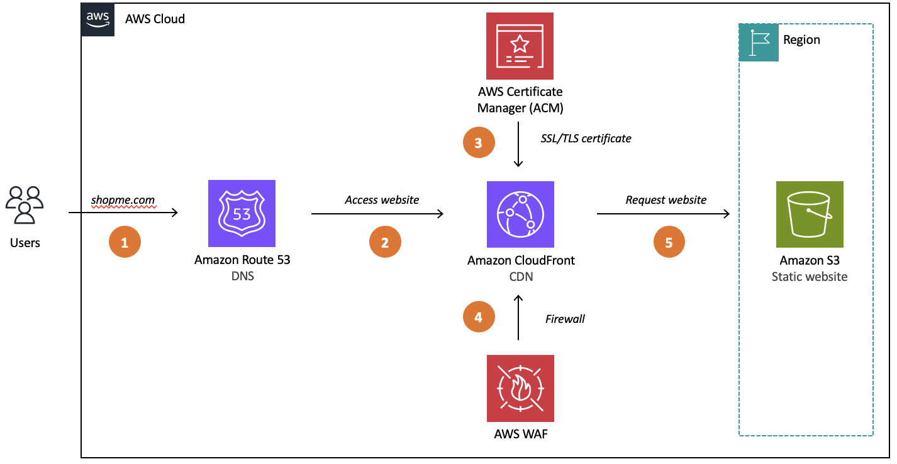

# Serverless Global E-Commerce Website on AWS

## Introduction

This project was built to **create a cost-effective and secure e-commerce website** that showcases a product catalog with **high-resolution images** and delivers **fast loading times for global customers**.

Many traditional e-commerce solutions rely on server-based architectures that are expensive to scale, difficult to secure, and slow for international users. The goal of this project was to demonstrate how a **fully serverless, cloud-native architecture** can solve these challenges while maintaining performance, security, and reliability.

## Architecture & Tech Stack

### Architecture Overview



### AWS Services Used

* **Amazon Route 53** – Domain name resolution and traffic routing
* **Amazon CloudFront** – Global content delivery network for low-latency access
* **Amazon S3** – Static website hosting and product image storage
* **AWS Certificate Manager** – SSL/TLS certificates for HTTPS
* **AWS WAF** – Protection against malicious web traffic

### Request Flow

1. Users enter the website domain (e.g., `shopme.com`) in their browser.
2. **Route 53** resolves the domain and routes the request to CloudFront.
3. **CloudFront** checks for cached content at the nearest edge location.
4. If cached, content is delivered immediately. If not, CloudFront retrieves it from S3 and caches it.
5. **ACM** encrypts the connection using HTTPS.
6. **WAF** inspects and filters requests before content is served.
7. **S3** stores and serves the static website files and high-resolution images.

### Key Architecture Benefits

* Serverless and fully managed
* Highly available and fault tolerant
* Globally distributed for fast performance
* Secure by default with HTTPS and WAF
* Cost-efficient pay-as-you-go pricing

## Result & Live Demo

### Results

* Fully functional e-commerce static website
* Fast page load times for global users
* Secure HTTPS access with web traffic protection
* Optimized delivery of high-resolution product images

### Deployment Instructions

This project is deployed using **AWS CloudFormation** to make the setup simple and repeatable.

#### Prerequisites

* An AWS account
* AWS CLI installed and configured
* A registered domain name (optional, but recommended)

#### Deployment Steps

1. **Clone the Repository**

   ```bash
   git clone https://github.com/your-username/serverless-ecommerce-aws.git
   cd serverless-ecommerce-aws
   ```

2. **Deploy the CloudFormation Stack**

   ```bash
   aws cloudformation deploy \
     --template-file template.yaml \
     --stack-name serverless-ecommerce \
     --capabilities CAPABILITY_NAMED_IAM
   ```

3. **Upload Website Files to S3**

    After the stack is deployed, copy your static website files to the S3 bucket created by CloudFormation:

   ```bash
   aws s3 sync ./website s3://<S3_BUCKET_NAME>
   ```

4. **Get the Website URL**

   * After deployment completes, retrieve the CloudFront distribution URL from the CloudFormation outputs.
   * (Optional) Point your domain to CloudFront using Route 53.

5. **Access the Website**

   * Open the CloudFront URL or custom domain in your browser.
   * Your e-commerce website is now live and globally accessible.


### Live Demo

👉 **[https://shopme.example.com](https://shopme.example.com)**

## Impact & Value

### Technical Impact

* Improved performance using global CDN caching
* Reduced infrastructure complexity with a serverless design
* Enhanced security using WAF and SSL/TLS encryption
* Lower operational costs with managed AWS services

### Business Value

* Better user experience for global customers
* Increased reliability and uptime
* Cost savings from eliminating server maintenance
* Scalable architecture ready for traffic spikes

### Key Learnings

* Designing production-ready cloud architectures
* Implementing secure, high-performance content delivery
* Optimizing cost and performance using AWS best practices

---

⭐ **If you found this project helpful, feel free to star the repository!**
